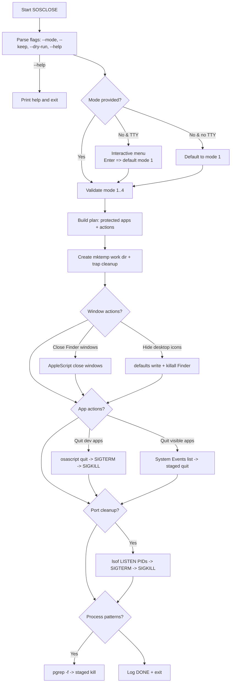

# SOSCLOSE: A safe, multi‑mode macOS zsh “pre‑call / fresh start” script

## Executive summary

This report designs and implements **SOSCLOSE**, a **safe, multi‑mode** macOS `zsh` script intended to declutter your workspace quickly (especially before video calls) without the “nuclear” behaviour of indiscriminately killing user processes. It uses **AppleScript via `osascript`** for app lifecycle actions, and **official macOS command‑line tooling** (`pgrep`/`pkill`, `kill`, `killall`, `lsof`, `defaults`, `mktemp`) for verification, staged termination, port cleanup, and robust temporary file handling. 

Key safety features include:

A **staged quit sequence** (request quit via AppleScript → wait → send `SIGTERM` → wait → send `SIGKILL` only if needed), matching the semantics of POSIX signals and macOS tooling—`SIGKILL` is explicitly non‑catchable / non‑ignorable and therefore treated as a last resort. 

Respect for macOS privacy controls: controlling other apps via Apple events may trigger **Automation** permission prompts; and any UI‑scripting‑style operations (such as manipulating process visibility/minimising windows via System Events) rely on **Accessibility** authorisation. 

Four modes (selected interactively or via flags) with “sane defaults”:
- **Mode 1 (Call mode)**: presentation‑first, safest; prioritises window‑level clean‑up and quits non‑protected visible apps.
- **Mode 2 (Dev cleanup)**: stops common dev web ports and dev runtimes more carefully.
- **Mode 3 (Aggressive cleanup / Fresh start)**: broader app closure + ports (including optional “datastore” ports by default, with clear warnings).
- **Mode 4 (Custom cleanup)**: interactive toggles for each action.

The deliverables below include the full ready‑to‑run script, a concise usage table, a Mermaid flowchart, and sample log output.

## Research findings that constrain a “safe” macOS approach

macOS automation has two practical layers relevant to this script:

**Application scripting via Apple events (AppleScript / `osascript`)**  
`osascript` executes AppleScript (and other OSA languages) from the shell. 
Many macOS apps (including Finder and System Events) expose scriptable dictionaries; Apple’s AppleScript Language Guide highlights that macOS‑shipped scriptable apps such as **Finder** and **System Events** provide useful commands and objects.  
Apple’s Terminal User Guide explicitly documents running AppleScript from Terminal using `osascript`. 

**UI scripting (System Events “Processes Suite”) and security**  
When you go beyond “tell app to quit” and start interacting with UI elements or process visibility, macOS treats this as **Accessibility‑mediated** UI scripting. Apple’s Mac Automation Scripting Guide states that UI scripting relies on accessibility frameworks, is disabled by default, and must be enabled **per app** for security/privacy. 
In addition, macOS can prompt for **Automation** permission when one app attempts to control another; Apple Support documents authorising (or denying) apps and checking/adjusting permissions in **Privacy & Security → Automation**. 

For termination, the “safe by default” pattern is:

- Prefer requesting an app to quit (so it can save state).
- Use `SIGTERM` for a polite process‑level termination request.
- Use `SIGKILL` only if the target cannot be terminated—macOS manpages describe `SIGKILL` as non‑catchable and non‑ignorable. 

The built‑in tools used here have explicitly documented semantics:

- `kill` sends signals to PIDs; only the super‑user may send signals to other users’ processes.  
- `killall` targets by process name and defaults to `TERM`; its regex matching mode is explicitly labelled dangerous. 
- `pgrep`/`pkill` search the process table; `-f` matches full argument lists; `-x` requires exact matches; patterns are regex.
- `lsof -i` selects internet network files; the manpage gives examples combining `-iTCP` and `-sTCP:LISTEN` to filter listening sockets. 
- `defaults` reads/writes user defaults and explicitly warns against modifying defaults belonging to a currently running application (because it may overwrite or not see changes). 
- `mktemp` provides unique temporary file/directory creation using `XXXXXX` templates. 
- `trap` is a documented zsh builtin used here to guarantee clean‑up of temp resources even on interrupt/termination. 

These constraints drive the implementation choices: avoid “kill everything”; avoid regex killall modes; prefer `osascript` quit; verify with `pgrep`; stage escalation; and treat window/desktop clean‑ups as optional and clearly logged.

## Mode descriptions and exact behaviours

SOSCLOSE implements **four modes**, selectable by interactive prompt (default on pressing Enter) or `-m/--mode`. Each mode composes a set of actions. Where an action uses Apple events (e.g., `tell application ...`), macOS may prompt once for Automation permissions. Where an action uses UI scripting (e.g., minimising windows via System Events), macOS requires Accessibility authorisation for the calling app (typically Terminal) as described by Apple’s UI scripting guide. citeturn7search3turn4view0

**Default action ordering (all modes)**  
Window‑level actions → app quit actions → port cleanup → dev process cleanup → printed summary.

**Mode 1: Call mode (default)**  
Purpose: make the screen “presentable” quickly, with lowest risk.

Exact behaviour:
- Closes Finder windows (`tell application "Finder" to close every window`). This uses standard AppleScript “close window” patterns that are documented in Apple’s AppleScript Language Guide examples.
- Optionally hides desktop icons (default **ON** in this mode): writes Finder’s `CreateDesktop` preference and restarts Finder. This uses the official `defaults` tool and `killall` to restart Finder; note Apple’s warning about modifying defaults of a running app.   
- Quits **visible non‑background GUI apps** except protected/kept apps, using the staged quit sequence:
  - `osascript`: `tell application "<app>" to quit` 
  - verify with `pgrep` and then `SIGTERM`/`SIGKILL` escalation if still running 
- Stops “web dev” ports only (safe subset): by default `3000, 5173, 8000, 8080, 8081` using `lsof -iTCP:<port> -sTCP:LISTEN -t` then staged `SIGTERM`/`SIGKILL`.  
- Does **not** attempt broad runtime kills (“all node/java”), and does **not** unload LaunchAgents.

**Mode 2: Dev cleanup**  
Purpose: stop local development services with less disruption to non‑dev apps.

Exact behaviour:
- Does **not** hide desktop icons by default.
- Quits a curated list of dev‑centric GUI apps (configurable in script) using staged quit (`osascript` → signals).
- Stops “web dev” ports (broader than Call mode): default includes `3000, 3001, 4000, 5000, 5173, 5500, 5678, 8000, 8080, 8081, 9000, 9229`. Port discovery and filtering uses documented `lsof -iTCP -sTCP:LISTEN`. 
- Stops dev processes by *narrow patterns* (e.g., `vite`, `react-scripts`, `next dev`, `uvicorn`) via `pgrep -f` then staged signals; avoids “kill all node” behaviour. 

**Mode 3: Aggressive cleanup (Fresh start)**  
Purpose: close most visible apps and stop ports broadly while still avoiding “kill all user processes”.

Exact behaviour:
- Closes Finder windows.
- Hides desktop icons by default (and logs how to revert).
- Quits all visible non‑background GUI apps except protected/kept apps with staged quit.
- Stops both “web dev” ports and common “datastore” ports (default includes `5432, 6379, 27017, 9200` as higher‑impact services) using the same port‑based staged termination. 
- Stops dev processes by patterns (as in Mode 2), but with slightly broader matching.

**Mode 4: Custom cleanup**  
Purpose: interactive chooser for each action, to match “today’s” call/workflow.

Exact behaviour:
- Prompts for each of:
  - close Finder windows
  - hide desktop icons (persistent until reverted)
  - hide/minimise windows (best effort; may require Accessibility)
  - quit visible apps
  - stop ports (comma‑separated)
  - stop dev process patterns
- Runs only the selected actions, consistent with the same staged termination and keep/protect logic.

## Defaults, allowlists, normalisation rules, and safety mechanics

**Protected/allowlisted apps**  
SOSCLOSE maintains:
- A **base protected list**: `Terminal`, `iTerm2`, `Dock`, `SystemUIServer`, `Finder` (never quit as part of “close visible apps”).  
- Mode‑specific protection: Call mode additionally protects common meeting/browsing apps by default (configurable), to reduce the chance you close the tool you’re about to use.  
- A user‑supplied keep list via repeatable `--keep <app>` which is applied across all modes.

**App matching and normalisation**  
The script normalises app tokens to reduce foot‑guns:
- trims leading/trailing whitespace
- case‑insensitive comparisons for keep/protect checks (via zsh lower‑casing)
- alias mapping (examples): `slack` → `Slack`, `teams` → `Microsoft Teams`, `chrome` → `Google Chrome`, `vscode`/`code` → `Visual Studio Code`, `zoom` → `zoom.us`.

**Staged quit sequence**  
For a GUI app `<app>`:
1. AppleScript request quit: `tell application "<app>" to quit` via `osascript`. citeturn6view0  
2. Wait a small grace period.
3. If still running (verified via `pgrep`), send `SIGTERM`. `kill` defaults to `TERM` if unspecified and documents signal selection. 
4. If still running after timeout, send `SIGKILL` (non‑catchable / non‑ignorable). 

**Port‑based safe shutdown**  
For each port:
- discover listening PIDs using `lsof` network selection: `-iTCP:<port> -sTCP:LISTEN -t` which is directly aligned with lsof’s documented `-iTCP -sTCP:LISTEN` usage patterns. 
- staged `SIGTERM` → wait → `SIGKILL` only if needed. 

**Window‑level actions**  
- Closing Finder windows uses AppleScript `close` on windows; Apple’s language guide includes examples of closing Finder windows with `tell application "Finder" ... close ...`.  
- Hiding desktop icons uses `defaults write com.apple.finder CreateDesktop -bool false` and restarts Finder; because `defaults` warns against modifying a running app’s defaults, the script always restarts Finder after writing.
- Minimising windows uses System Events UI scripting on a best‑effort basis; Apple’s UI scripting guide explains this class of automation relies on Accessibility authorisation. 

**Temp files and traps**  
The script creates a unique temp working directory with `mktemp` and guarantees clean‑up using `trap` on exit and interrupts. 

**Logging format**  
All actions are logged with timestamps to both stdout and `~/sosclose.log`, with event‑style lines (START, SKIP, QUIT, TERM, KILL, PORT, DONE). `--dry-run` logs “would do” actions without making changes.

## Full annotated zsh script

```zsh
#!/bin/zsh
# SOSCLOSE — Safe multi-mode macOS tidy-up script (zsh)
#
# Goals:
# - Provide a fast “pre-call” declutter without unsafe “kill everything” behaviour.
# - Support interactive mode selection (1–4) with sensible defaults.
# - Support non-interactive usage: -m/--mode, repeatable --keep <app>, --dry-run, --help.
# - Use a staged quit sequence: osascript quit → SIGTERM → SIGKILL (last resort).
# - Optionally stop processes by listening port (lsof) using staged termination.
# - Provide optional window-level actions: close Finder windows, hide desktop icons, best-effort minimise windows.
#
# Notes:
# - First-time runs may trigger macOS Automation prompts (Terminal controlling other apps).
# - UI-scripting-style actions (minimising/hiding via System Events) may require Accessibility permission.

set +e  # keep running even if an app fails to quit

###############################################################################
# Configuration (edit to taste)
###############################################################################

SCRIPT_VERSION="1.0.0"
LOG_FILE="${HOME}/sosclose.log"

# Timeouts (seconds)
QUIT_GRACE=2         # after requesting quit via AppleScript
TERM_TIMEOUT=4       # wait after SIGTERM before escalating
KILL_TIMEOUT=2       # wait after SIGKILL (best-effort)

PORT_TERM_TIMEOUT=3
PORT_KILL_TIMEOUT=2

# Base protected apps: never quit as part of “close visible apps”
# (You can still close Finder windows or restart Finder for desktop icon changes.)
PROTECTED_APPS_BASE=(
  "Terminal"
  "iTerm2"
  "Dock"
  "SystemUIServer"
  "Finder"
)

# Call-mode additional protection (reduce chance of closing your meeting tool)
# You can override by selecting a different mode or by editing this list.
PROTECTED_APPS_CALL_EXTRA=(
  "zoom.us"
  "Microsoft Teams"
  "Google Chrome"
  "Safari"
  "FaceTime"
)

# Dev-mode “dev apps” (only targeted in Dev cleanup mode)
DEV_APPS=(
  "Visual Studio Code"
  "Xcode"
  "IntelliJ IDEA"
  "WebStorm"
  "PyCharm"
  "Android Studio"
  "Docker Desktop"
  "Postman"
)

# Port sets
PORTS_CALL=(3000 5173 8000 8080 8081)
PORTS_DEV_WEB=(3000 3001 4000 5000 5173 5500 5678 8000 8080 8081 9000 9229)
PORTS_DEV_DATA=(5432 6379 27017 9200) # higher-impact “datastore” ports

# Dev process patterns (narrow, avoids “kill all node/java”)
# These are regex patterns used with: pgrep -f PATTERN
DEV_PROCESS_PATTERNS=(
  "vite"
  "react-scripts"
  "next[[:space:]]dev"
  "webpack-dev-server"
  "nodemon"
  "python[[:space:]].*-m[[:space:]]http\\.server"
  "uvicorn"
  "gunicorn"
  "django.*runserver"
  "rails[[:space:]]server"
  "kubectl[[:space:]]proxy"
  "docker-compose"
)

###############################################################################
# Logging helpers
###############################################################################

# Log everything to file AND stdout
exec > >(tee -a "$LOG_FILE") 2>&1

ts() { date "+%Y-%m-%dT%H:%M:%S%z"; }

log() {
  local level="$1"; shift
  printf "[%s] %-7s %s\n" "$(ts)" "$level" "$*"
}

die() {
  log "ERROR" "$*"
  exit 1
}

###############################################################################
# Utility helpers
###############################################################################

trim() {
  local s="$1"
  s="${s#"${s%%[![:space:]]*}"}"
  s="${s%"${s##*[![:space:]]}"}"
  print -r -- "$s"
}

escape_applescript_string() {
  # Escapes backslash and double quote for embedding in: osascript -e "tell application \"...\""
  local s="$1"
  s="${s//\\/\\\\}"
  s="${s//\"/\\\"}"
  print -r -- "$s"
}

normalise_app_name() {
  # Maps friendly tokens to canonical app names (as commonly reported by System Events / process names).
  local raw; raw="$(trim "$1")"
  local key="${raw:l}"

  case "$key" in
    slack) print -r -- "Slack" ;;
    teams|msteams|"microsoft teams") print -r -- "Microsoft Teams" ;;
    zoom|"zoom.us") print -r -- "zoom.us" ;;
    chrome|"google chrome") print -r -- "Google Chrome" ;;
    safari) print -r -- "Safari" ;;
    finder) print -r -- "Finder" ;;
    terminal) print -r -- "Terminal" ;;
    iterm|iterm2) print -r -- "iTerm2" ;;
    vscode|code|"visual studio code") print -r -- "Visual Studio Code" ;;
    *)
      # Fallback: keep as entered (trimmed)
      print -r -- "$raw"
      ;;
  esac
}

array_contains_ci() {
  # case-insensitive exact match
  local needle="${1:l}"; shift
  local item
  for item in "$@"; do
    if [[ "${item:l}" == "$needle" ]]; then
      return 0
    fi
  done
  return 1
}

###############################################################################
# Process and app control (staged termination)
###############################################################################

wait_for_pid_exit() {
  local pid="$1"
  local timeout="$2"
  local i=0
  while (( i < timeout )); do
    if ! kill -0 "$pid" 2>/dev/null; then
      return 0
    fi
    sleep 1
    (( i++ ))
  done
  return 1
}

staged_kill_pid() {
  local pid="$1"
  local label="$2"
  local term_timeout="${3:-$TERM_TIMEOUT}"
  local kill_timeout="${4:-$KILL_TIMEOUT}"

  if ! kill -0 "$pid" 2>/dev/null; then
    log "INFO" "PID already gone: ${label} pid=${pid}"
    return 0
  fi

  if (( DRY_RUN )); then
    log "DRYRUN" "Would SIGTERM then SIGKILL (if needed): ${label} pid=${pid}"
    return 0
  fi

  log "TERM" "SIGTERM -> ${label} pid=${pid}"
  kill -TERM "$pid" 2>/dev/null
  wait_for_pid_exit "$pid" "$term_timeout" && return 0

  log "KILL" "SIGKILL (last resort) -> ${label} pid=${pid}"
  kill -KILL "$pid" 2>/dev/null
  wait_for_pid_exit "$pid" "$kill_timeout" && return 0

  # If still alive, we log but do not loop forever.
  if kill -0 "$pid" 2>/dev/null; then
    log "WARN" "Process still running after SIGKILL: ${label} pid=${pid}"
  fi
}

is_app_running() {
  local app="$1"
  pgrep -ix "$app" >/dev/null 2>&1
}

is_protected_app() {
  local app="$1"
  local canon; canon="$(normalise_app_name "$app")"
  array_contains_ci "$canon" "${PROTECTED_APPS[@]}" && return 0
  array_contains_ci "$canon" "${KEEP_APPS[@]}" && return 0
  return 1
}

request_app_quit() {
  local app="$1"
  local escaped; escaped="$(escape_applescript_string "$app")"

  if (( DRY_RUN )); then
    log "DRYRUN" "Would request quit via AppleScript: ${app}"
    return 0
  fi

  # Best-effort: some apps may not be scriptable; errors are suppressed.
  osascript -e "tell application \"${escaped}\" to quit" >/dev/null 2>&1
}

close_app_staged() {
  local app="$1"
  local canon; canon="$(normalise_app_name "$app")"

  if is_protected_app "$canon"; then
    log "SKIP" "Protected/kept app: ${canon}"
    return 0
  fi

  if ! is_app_running "$canon"; then
    return 0
  fi

  log "QUIT" "Requesting quit: ${canon}"
  request_app_quit "$canon"
  sleep "$QUIT_GRACE"

  # If still running, staged kill by exact process name match.
  local pids
  pids="$(pgrep -ix "$canon" 2>/dev/null)"
  if [[ -n "$pids" ]]; then
    local pid
    for pid in ${(f)pids}; do
      staged_kill_pid "$pid" "$canon"
    done
  fi
}

###############################################################################
# AppleScript queries (visible apps)
###############################################################################

get_visible_gui_apps_csv() {
  # Returns comma-separated app names (string) via System Events.
  osascript <<'APPLESCRIPT'
tell application "System Events"
  set appList to name of every application process whose background only is false
  return appList as string
end tell
APPLESCRIPT
}

close_visible_gui_apps() {
  local csv; csv="$(get_visible_gui_apps_csv 2>/dev/null)"
  if [[ -z "$csv" ]]; then
    log "WARN" "Could not query visible apps (System Events)."
    return 0
  fi

  local app
  for app in ${(s:,:)csv}; do
    app="$(trim "$app")"
    [[ -z "$app" ]] && continue
    close_app_staged "$app"
  done
}

###############################################################################
# Window-level actions
###############################################################################

close_finder_windows() {
  if (( DRY_RUN )); then
    log "DRYRUN" "Would close Finder windows"
    return 0
  fi
  # Close every Finder window (does not quit Finder).
  osascript -e 'tell application "Finder" to close every window' >/dev/null 2>&1
  log "INFO" "Closed Finder windows (best effort)"
}

set_desktop_icons_hidden() {
  # This is a persistent preference until reversed.
  # Revert with:
  #   defaults write com.apple.finder CreateDesktop -bool true; killall Finder
  if (( DRY_RUN )); then
    log "DRYRUN" "Would hide desktop icons (defaults write + restart Finder)"
    return 0
  fi

  local current
  current="$(defaults read com.apple.finder CreateDesktop 2>/dev/null)"
  if [[ -z "$current" ]]; then
    current="(unset → default shown)"
  fi

  log "INFO" "Desktop icon preference before: CreateDesktop=${current}"
  defaults write com.apple.finder CreateDesktop -bool false >/dev/null 2>&1
  killall Finder >/dev/null 2>&1
  log "INFO" "Desktop icons hidden (persistent) — revert: defaults write com.apple.finder CreateDesktop -bool true; killall Finder"
}

minimise_app_windows_best_effort() {
  # Best-effort UI scripting via System Events; may require Accessibility permission.
  local app="$1"
  local escaped; escaped="$(escape_applescript_string "$app")"

  if (( DRY_RUN )); then
    log "DRYRUN" "Would attempt to minimise windows via System Events: ${app}"
    return 0
  fi

  osascript -e "tell application \"System Events\" to tell process \"${escaped}\" to set value of attribute \"AXMinimized\" of every window to true" \
    >/dev/null 2>&1
  log "INFO" "Attempted to minimise windows (best effort): ${app}"
}

###############################################################################
# Port-based shutdown
###############################################################################

should_skip_by_keep_pattern() {
  # For non-app processes (ports/patterns), interpret KEEP_APPS as “do not touch if substring matches”.
  # This is intentionally conservative and case-insensitive.
  local hay="${1:l}"
  local k
  for k in "${KEEP_APPS[@]}"; do
    local needle="${k:l}"
    [[ -z "$needle" ]] && continue
    if [[ "$hay" == *"$needle"* ]]; then
      return 0
    fi
  done
  return 1
}

stop_listening_port() {
  local port="$1"
  local pids

  # Use lsof network selection to find LISTEN sockets on this TCP port.
  pids="$(lsof -nP -iTCP:"$port" -sTCP:LISTEN -t 2>/dev/null)"
  [[ -z "$pids" ]] && return 0

  local pid
  for pid in ${(f)pids}; do
    [[ -z "$pid" ]] && continue

    local cmd
    cmd="$(ps -p "$pid" -o command= 2>/dev/null)"
    [[ -z "$cmd" ]] && cmd="(unknown)"

    if should_skip_by_keep_pattern "$cmd"; then
      log "SKIP" "Port ${port}: kept by pattern (cmd contains keep token) pid=${pid} cmd=${cmd}"
      continue
    fi

    log "PORT" "Stopping port ${port} pid=${pid} cmd=${cmd}"
    staged_kill_pid "$pid" "port:${port}" "$PORT_TERM_TIMEOUT" "$PORT_KILL_TIMEOUT"
  done
}

stop_ports() {
  local ports=("$@")
  local port
  for port in "${ports[@]}"; do
    stop_listening_port "$port"
  done
}

###############################################################################
# Dev process pattern shutdown
###############################################################################

stop_dev_process_patterns() {
  local pattern
  for pattern in "${DEV_PROCESS_PATTERNS[@]}"; do
    local pids
    pids="$(pgrep -f "$pattern" 2>/dev/null)"
    [[ -z "$pids" ]] && continue

    local pid
    for pid in ${(f)pids}; do
      [[ -z "$pid" ]] && continue

      local cmd
      cmd="$(ps -p "$pid" -o command= 2>/dev/null)"
      [[ -z "$cmd" ]] && cmd="(unknown)"

      if should_skip_by_keep_pattern "$cmd"; then
        log "SKIP" "Dev pattern '${pattern}': kept by keep token pid=${pid} cmd=${cmd}"
        continue
      fi

      log "PROC" "Stopping dev process (pattern='${pattern}') pid=${pid} cmd=${cmd}"
      staged_kill_pid "$pid" "pattern:${pattern}"
    done
  done
}

###############################################################################
# CLI / interactive UI
###############################################################################

usage() {
  cat <<EOF
SOSCLOSE ${SCRIPT_VERSION}

Usage:
  ./SOSCLOSE
  ./SOSCLOSE -m 2
  ./SOSCLOSE --mode 1 --keep slack --keep teams
  ./SOSCLOSE --dry-run --keep "Google Chrome"

Options:
  -m, --mode N        Mode number: 1 (Call), 2 (Dev cleanup), 3 (Aggressive), 4 (Custom)
  --keep APP          Protect an app from being quit/killed (repeatable)
  --dry-run           Print what would happen, but do not change state
  --help              Show this help

Notes:
  - macOS may show Automation prompts the first time Terminal/osascript controls an app.
  - UI scripting actions (e.g. minimise via System Events) may require Accessibility permission.
EOF
}

MODE=""
DRY_RUN=0
KEEP_APPS=()

while [[ $# -gt 0 ]]; do
  case "$1" in
    -m|--mode)
      MODE="$2"
      shift 2
      ;;
    --mode=*)
      MODE="${1#*=}"
      shift
      ;;
    --keep)
      [[ -z "${2:-}" ]] && die "--keep requires an argument"
      KEEP_APPS+=("$(normalise_app_name "$2")")
      shift 2
      ;;
    --keep=*)
      KEEP_APPS+=("$(normalise_app_name "${1#*=}")")
      shift
      ;;
    --dry-run|-n)
      DRY_RUN=1
      shift
      ;;
    --help|-h)
      usage
      exit 0
      ;;
    *)
      die "Unknown option: $1 (use --help)"
      ;;
  esac
done

select_mode_interactive() {
  log "INFO" "Choose mode:"
  print -r -- "  1) Call mode — close Finder windows, hide desktop icons, quit visible apps, stop common web dev ports"
  print -r -- "  2) Dev cleanup — quit dev apps, stop web dev ports, stop common dev processes"
  print -r -- "  3) Aggressive (Fresh start) — broader app closing, stop web+datastore ports, more dev cleanup"
  print -r -- "  4) Custom cleanup — choose actions interactively"
  print -n -- "Press Enter for default [1]: "
  local choice=""
  read -r choice
  choice="${choice:-1}"
  print -r -- "$choice"
}

if [[ -z "$MODE" ]]; then
  if [[ -t 0 ]]; then
    MODE="$(select_mode_interactive)"
  else
    MODE="1"
    log "WARN" "No --mode provided and no TTY available; defaulting to mode 1"
  fi
fi

# Validate mode
case "$MODE" in
  1|2|3|4) ;;
  *) die "Invalid mode: $MODE (expected 1..4)" ;;
esac

###############################################################################
# Temp workspace + trap
###############################################################################

WORK_DIR="$(mktemp -d "${TMPDIR:-/tmp}/sosclose.XXXXXX" 2>/dev/null)" || die "Failed to create temp dir"
trap 'rm -rf "$WORK_DIR" 2>/dev/null' EXIT INT TERM

SUMMARY_APPS="${WORK_DIR}/closed_apps.txt"
SUMMARY_PORTS="${WORK_DIR}/closed_ports.txt"
SUMMARY_PROCS="${WORK_DIR}/closed_processes.txt"

###############################################################################
# Mode planning
###############################################################################

PROTECTED_APPS=("${PROTECTED_APPS_BASE[@]}")

DO_CLOSE_FINDER_WINDOWS=0
DO_HIDE_DESKTOP_ICONS=0
DO_MINIMISE_WINDOWS=0
DO_CLOSE_VISIBLE_APPS=0
DO_CLOSE_DEV_APPS=0
DO_STOP_PORTS=0
DO_STOP_PROCS=0

PORTS_TO_STOP=()

MODE_NAME=""
case "$MODE" in
  1)
    MODE_NAME="Call mode"
    PROTECTED_APPS+=("${PROTECTED_APPS_CALL_EXTRA[@]}")
    DO_CLOSE_FINDER_WINDOWS=1
    DO_HIDE_DESKTOP_ICONS=1
    DO_CLOSE_VISIBLE_APPS=1
    DO_STOP_PORTS=1
    PORTS_TO_STOP=("${PORTS_CALL[@]}")
    DO_STOP_PROCS=0
    ;;
  2)
    MODE_NAME="Dev cleanup"
    DO_CLOSE_FINDER_WINDOWS=0
    DO_HIDE_DESKTOP_ICONS=0
    DO_CLOSE_DEV_APPS=1
    DO_STOP_PORTS=1
    PORTS_TO_STOP=("${PORTS_DEV_WEB[@]}")
    DO_STOP_PROCS=1
    ;;
  3)
    MODE_NAME="Aggressive cleanup (Fresh start)"
    DO_CLOSE_FINDER_WINDOWS=1
    DO_HIDE_DESKTOP_ICONS=1
    DO_CLOSE_VISIBLE_APPS=1
    DO_STOP_PORTS=1
    PORTS_TO_STOP=("${PORTS_DEV_WEB[@]}" "${PORTS_DEV_DATA[@]}")
    DO_STOP_PROCS=1
    ;;
  4)
    MODE_NAME="Custom cleanup"
    if [[ -t 0 ]]; then
      local ans
      print -n -- "Close Finder windows? [Y/n]: "
      read -r ans; ans="${ans:-Y}"
      [[ "${ans:l}" == "y" ]] && DO_CLOSE_FINDER_WINDOWS=1

      print -n -- "Hide desktop icons (persistent until reverted)? [y/N]: "
      read -r ans; ans="${ans:-N}"
      [[ "${ans:l}" == "y" ]] && DO_HIDE_DESKTOP_ICONS=1

      print -n -- "Minimise windows of visible apps (best effort; may need Accessibility)? [y/N]: "
      read -r ans; ans="${ans:-N}"
      [[ "${ans:l}" == "y" ]] && DO_MINIMISE_WINDOWS=1

      print -n -- "Quit visible GUI apps (except protected/kept)? [y/N]: "
      read -r ans; ans="${ans:-N}"
      [[ "${ans:l}" == "y" ]] && DO_CLOSE_VISIBLE_APPS=1

      print -n -- "Stop listening ports? (comma-separated, e.g. 3000,5173) [Enter for none]: "
      read -r ans
      if [[ -n "$(trim "$ans")" ]]; then
        DO_STOP_PORTS=1
        local p
        for p in ${(s:,:)ans}; do
          p="$(trim "$p")"
          [[ "$p" == <-> ]] && PORTS_TO_STOP+=("$p")
        done
      fi

      print -n -- "Stop common dev process patterns (vite/uvicorn/etc.)? [y/N]: "
      read -r ans; ans="${ans:-N}"
      [[ "${ans:l}" == "y" ]] && DO_STOP_PROCS=1
    else
      log "WARN" "Custom mode selected without a TTY; no prompts available. Doing nothing."
    fi
    ;;
esac

###############################################################################
# Execution
###############################################################################

log "START" "SOSCLOSE v${SCRIPT_VERSION} mode=${MODE} (${MODE_NAME}) dry_run=${DRY_RUN}"
log "START" "Protected apps: ${PROTECTED_APPS[*]}"
log "START" "Keep apps: ${KEEP_APPS[*]:-(none)}"

if (( DO_CLOSE_FINDER_WINDOWS )); then
  close_finder_windows
fi

if (( DO_HIDE_DESKTOP_ICONS )); then
  set_desktop_icons_hidden
fi

if (( DO_MINIMISE_WINDOWS )); then
  # Minimise windows of currently visible GUI apps (excluding protected/kept).
  local csv; csv="$(get_visible_gui_apps_csv 2>/dev/null)"
  if [[ -n "$csv" ]]; then
    local a
    for a in ${(s:,:)csv}; do
      a="$(trim "$a")"
      [[ -z "$a" ]] && continue
      if is_protected_app "$a"; then
        log "SKIP" "Minimise: protected/kept app: $a"
      else
        minimise_app_windows_best_effort "$a"
      fi
    done
  fi
fi

if (( DO_CLOSE_DEV_APPS )); then
  local devapp
  for devapp in "${DEV_APPS[@]}"; do
    close_app_staged "$devapp"
  done
fi

if (( DO_CLOSE_VISIBLE_APPS )); then
  close_visible_gui_apps
fi

if (( DO_STOP_PORTS )); then
  if (( ${#PORTS_TO_STOP[@]} > 0 )); then
    stop_ports "${PORTS_TO_STOP[@]}"
  fi
fi

if (( DO_STOP_PROCS )); then
  stop_dev_process_patterns
fi

log "DONE" "Completed SOSCLOSE run."
log "DONE" "Log file: ${LOG_FILE}"
```

## Usage examples, flowchart, and sample logs

**Short usage table**

| Command | Effect (high level) |
|---|---|
| `./SOSCLOSE` | Prompts for mode; Enter selects **Mode 1 (Call mode)**. |
| `./SOSCLOSE -m 1` | Call mode: close Finder windows, hide desktop icons, quit visible apps except protected/kept, stop common web dev ports. |
| `./SOSCLOSE -m 2 --keep "Google Chrome"` | Dev cleanup while protecting Chrome from being quit/killed. |
| `./SOSCLOSE -m 3 --dry-run` | Prints all intended actions for Aggressive mode without changing state. |
| `./SOSCLOSE -m 1 --keep slack --keep teams` | Call mode but keep Slack and Teams open. |
| `./SOSCLOSE -m 4` | Custom mode: interactive questions for each action. |

**Mermaid flowchart (mode selection and action plan)**



**Sample log output**

```text
[2026-04-15T21:10:02+0530] START   SOSCLOSE v1.0.0 mode=1 (Call mode) dry_run=0
[2026-04-15T21:10:02+0530] START   Protected apps: Terminal iTerm2 Dock SystemUIServer Finder zoom.us Microsoft Teams Google Chrome Safari FaceTime
[2026-04-15T21:10:02+0530] START   Keep apps: Slack
[2026-04-15T21:10:03+0530] INFO    Closed Finder windows (best effort)
[2026-04-15T21:10:03+0530] INFO    Desktop icon preference before: CreateDesktop=(unset → default shown)
[2026-04-15T21:10:04+0530] INFO    Desktop icons hidden (persistent) — revert: defaults write com.apple.finder CreateDesktop -bool true; killall Finder
[2026-04-15T21:10:05+0530] SKIP    Protected/kept app: Slack
[2026-04-15T21:10:05+0530] QUIT    Requesting quit: Todoist
[2026-04-15T21:10:07+0530] TERM    SIGTERM -> Todoist pid=9123
[2026-04-15T21:10:08+0530] PORT    Stopping port 5173 pid=10444 cmd=node /path/to/vite ...
[2026-04-15T21:10:08+0530] TERM    SIGTERM -> port:5173 pid=10444
[2026-04-15T21:10:10+0530] DONE    Completed SOSCLOSE run.
[2026-04-15T21:10:10+0530] DONE    Log file: /Users/human/sosclose.log
```

**Safety notes (operational)**  
Using AppleScript from Terminal to control apps may trigger macOS **Automation** prompts, which you can review/manage in **Privacy & Security → Automation**.
If you enable the “minimise windows (best effort)” action, that is UI scripting and may require **Accessibility** permission for the caller (Terminal), as described by Apple’s UI scripting documentation. 
Desktop icon hiding is implemented by writing Finder defaults and restarting Finder; Apple cautions against modifying defaults of a running application, so SOSCLOSE restarts Finder immediately after the change and logs the revert command.